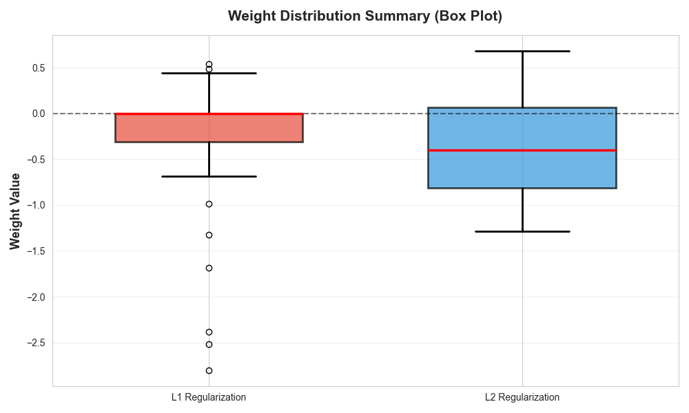
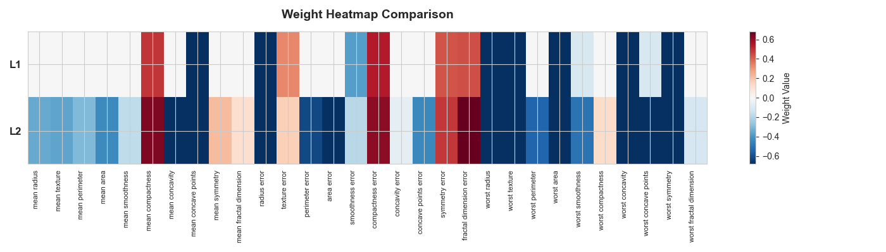
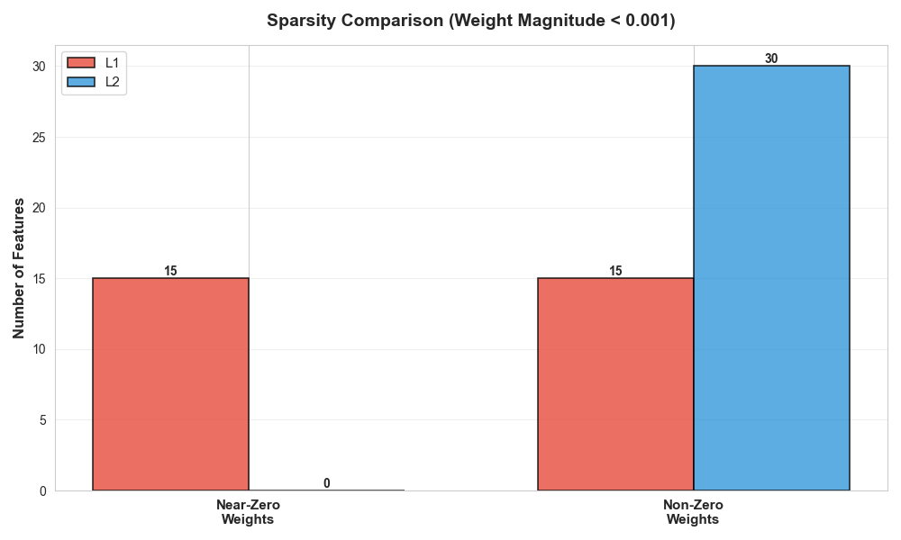
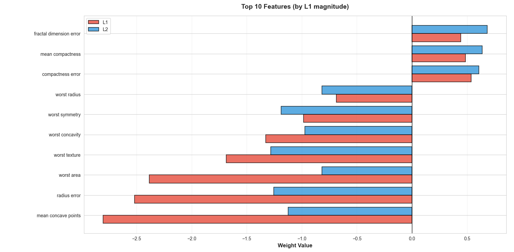
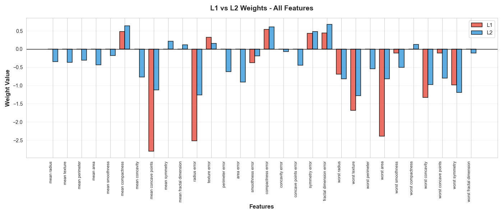

# L1 vs L2 Regularization in Logistic Regression

## Project Overview

This project demonstrates the effect of **L1 (Lasso)** and **L2 (Ridge)** regularization on a logistic regression model using the **Breast Cancer Wisconsin dataset**. The goal is to compare how different penalties affect the **feature coefficients** and model performance.

## Dataset

- Source: `sklearn.datasets.load_breast_cancer`
- Features: 30 numeric features (tumor measurements)
- Target: Binary classification (malignant = 0, benign = 1)

## Steps Implemented

1. **Load dataset** using `scikit-learn`.
2. **Split dataset** into training and test sets.
3. **Standardize features** for regularization.
4. **Train logistic regression models**:

   * L1 regularization (`penalty='l1'`) → promotes sparsity
   * L2 regularization (`penalty='l2'`) → shrinks coefficients
5. **Compare coefficients** to observe sparsity and magnitude differences.
6. **Evaluate model accuracy** on the test set.
7. **Visualize coefficients** using matplotlib.

## Visualizations

Below are the generated plots that illustrate coefficient distributions, sparsity, and heatmaps comparing L1 and L2 regularization.

### Weight distribution



### Weight magnitude


### Weight heatmap



### Sparsity comparison (L1 vs L2)



### L1 — top 10 coefficients



### All feature coefficients



> Note: Image files are referenced from the `images/` folder. If any image doesn't render, check the exact filenames in that directory.

## Usage

1. Clone the repo.
2. Create a virtual environment and install dependencies:

```bash
python -m venv venv
# Windows activate: venv\Scripts\activate
source venv/bin/activate    # On UNIX-like systems
pip install -r requirements.txt
```

3. Run the script (adjust the script name if needed):

```bash
python main.py
```

## Observations

- **L1 regularization** sets some coefficients to exactly zero → feature selection.
- **L2 regularization** shrinks coefficients but keeps all features.
- Accuracy is usually similar, but L1 improves interpretability.
- Visualization shows the differences in coefficient magnitude and sparsity.

## Author

- Vishesh Kumar
